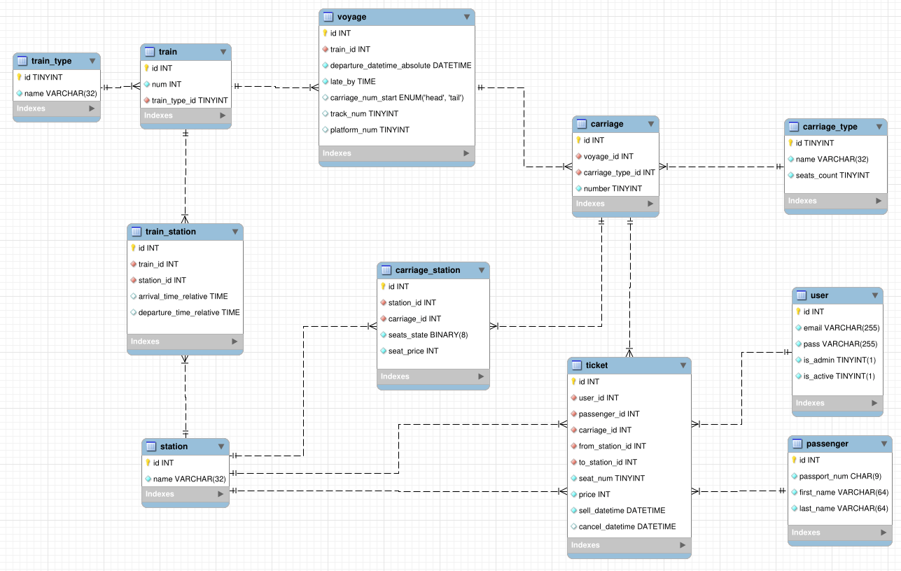

## railway-reservation-rs

Railway reservation system, written in Rust

[More screenshots](screenshots)

### Database ER diagram

[ER diagram in MySQL Workbench format (.mwb)](db/railway.mwb)

### Usage

1. Install `mariadb` & `libmysqlclient` using your distribution's package manager
   (e. g. `pacman`, `apt`).
2. Start MariaDB server:
   - for `runit`: for the first time after install run 
     `sudo touch /etc/sv/mysqld/down && sudo ln -s /etc/sv/mysqld /var/service` once,
	 then `sudo sv start mysqld` to start MariaDB.
   - for `systemd`: `sudo systemctl start mariadb`
3. `mysql -u root -p`, enter empty password
   - `CREATE USER 'artur'@localhost IDENTIFIED BY 'pass';`
   - `CREATE DATABASE railway;`
   - `GRANT ALL PRIVILEGES ON railway.* TO 'artur'@localhost;`
   - `quit`
4. `git clone https://github.com/Logarithmus/railway-reservation-rs && cd railway-reservation-rs`
5. `cargo run`
6. Go to `https://localhost:8443` in your browser.

### Tech stack

- Database: [`MariaDB`](https://mariadb.org)
- ORM: [`diesel`](https://diesel.rs)
- Backend framework: [`actix-web`](https://actix.rs)
- Template engine: [`yarte`](https://lib.rs/yarte)
- Password hashing: `Argon2` via [`argonautica`](https://lib.rs/argonautica)
- CSS framework: `Bootstrap 2.3.2`
- TLS: [`rustls`](https://lib.rs/rustls)
